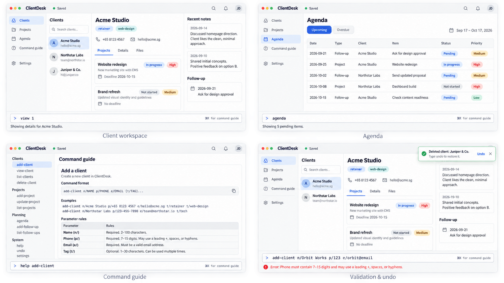

# ClientDesk

ClientDesk is a keyboard-first desktop CRM for freelancers and independent professionals who type fast and prefer typing to mouse interactions. It is designed to keep client details, projects, deadlines and follow-ups in one place.

ClientDesk is under active development. The current version supports contact management, while project, deadline and follow-up features are planned.

- [Project website](https://ay2627s1-cs2103t-t10-1.github.io/tp/)
- [User Guide](docs/UserGuide.md)
- [Developer Guide](docs/DeveloperGuide.md)
- [Development setup](docs/SettingUp.md)
- [Issue tracker](https://github.com/AY2627S1-CS2103T-T10-1/tp/issues)

## Team

- [iians0n](https://github.com/iians0n)
- [ClarenceChoo](https://github.com/ClarenceChoo)
- [ting436](https://github.com/ting436)
- [pang16334](https://github.com/pang16334)

## Acknowledgements

ClientDesk is based on [AddressBook Level 3](https://se-education.org/addressbook-level3/) by [SE-EDU](https://se-education.org/), using the [course starter repository](https://github.com/NUS-CS2103-AY2627-S1/tp).
