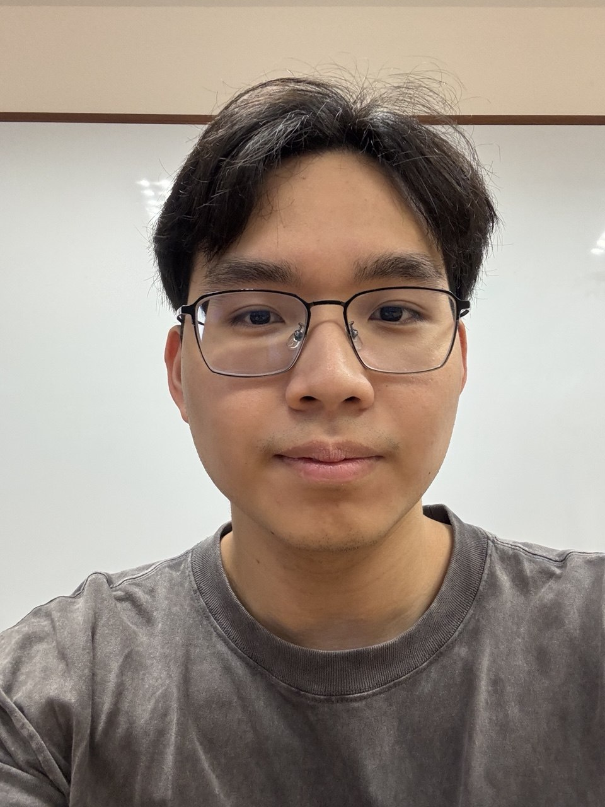
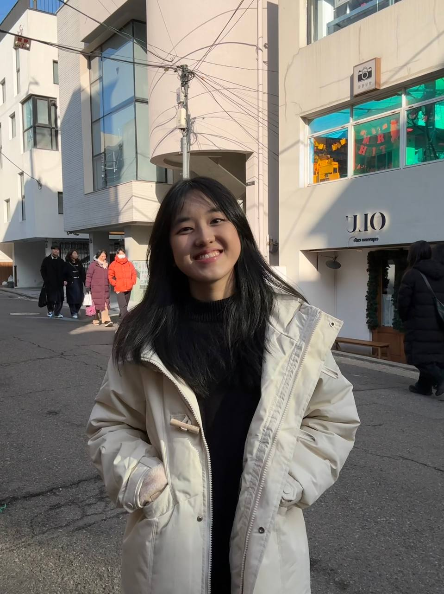

We are a team based in the [School of Computing, National University of Singapore](https://www.comp.nus.edu.sg).

You can reach us at the email `seer[at]comp.nus.edu.sg`

## Project team

### John Doe

[[homepage](http://www.comp.nus.edu.sg/~damithch)]
[[github](https://github.com/johndoe)]
[[portfolio](team/johndoe.md)]

* Role: Project Advisor

### Ng Ting Hui

[[github](http://github.com/ting436)]

* Role: Team Lead
* Responsibilities: UI

### Clarence Choo Jia Yi

[[github](https://github.com/ClarenceChoo)]

* Role: Developer
* Responsibilities: Client-management features and related testing

### Jean Doe

[[github](http://github.com/johndoe)]
[[portfolio](team/johndoe.md)]

* Role: Developer
* Responsibilities: Dev Ops + Threading

### Pang Yi Jie

[[github](https://github.com/pang16334)]

* Role: Developer
* Responsibilities: Develop features and user-facing product functionality that meet user requirements.
